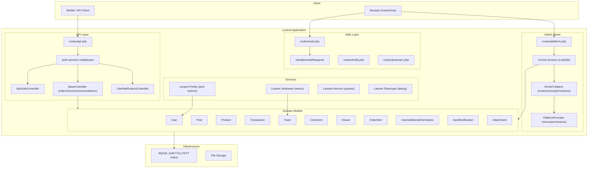
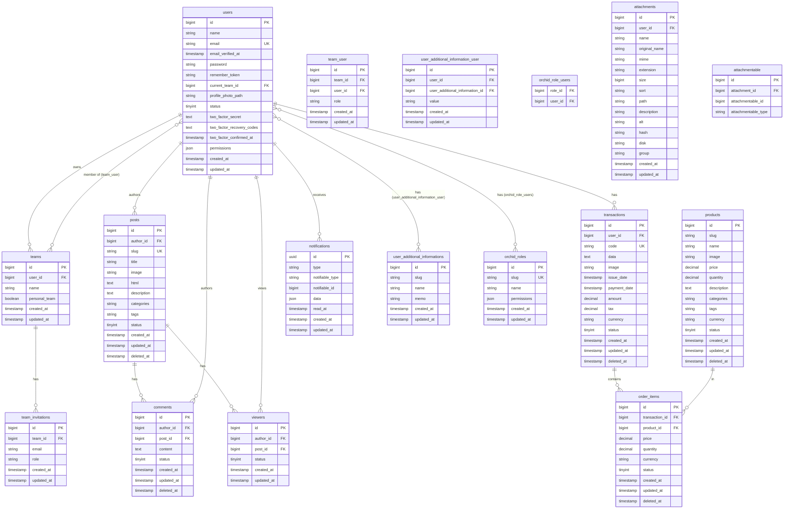

# Design Document

## Overview

Laravel Application là một hệ thống web đầy đủ tính năng được xây dựng trên Laravel framework. Hệ thống kết hợp nhiều package nổi tiếng để cung cấp:

- **Authentication**: Laravel Fortify + Jetstream (đăng ký, đăng nhập, 2FA, quản lý team)
- **Admin Panel**: Orchid Platform (CRUD screens, permissions, menu)
- **API**: REST API với Sanctum token authentication
- **Frontend**: Inertia.js + Vue.js (SPA-style rendering)
- **Queue/Debug**: Laravel Horizon + Telescope

Ứng dụng được thiết kế theo mô hình **modular scaffolding** — mỗi domain (Post, Product, Transaction, v.v.) có cấu trúc đồng nhất gồm Model, Migration, Orchid Screen, Helper, và API Controller. Lệnh `management:create` tự động sinh toàn bộ cấu trúc này từ stub files.

---

## Architecture



### Luồng xử lý chính

**API Request Flow:**
1. Request đến `routes/api.php` (chỉ active khi `fortify.user.enable = true`)
2. `auth:sanctum` middleware xác thực Bearer token
3. Controller kế thừa `BaseController` xử lý `index`/`show`/`recommendations`
4. Model query với `status = 1`, `orderBy id desc`
5. Response JSON

**Admin Panel Flow:**
1. Request đến `routes/platform.php` (Orchid prefix `/admin`)
2. Orchid middleware kiểm tra permission
3. Screen render layout + data
4. Helper class cung cấp routes, menu entries, permissions

**Scaffolding Flow (`management:create {name}`):**
1. Tạo Model từ stub
2. Tạo Migration
3. Tạo Orchid Helper, ListLayout, ListScreen, EditScreen
4. Tạo API Controller (optional)
5. Inject route vào `routes/platform.php` và `routes/api.php`
6. Inject menu/permission vào `PlatformProvider`

---

## Components and Interfaces

### BaseController (`app/Http/Controllers/BaseController.php`)

Controller gốc cho cả web và API. Tự động resolve Model từ tên class.

```
index()         → paginate() với status=1, orderBy id desc
show($id)       → tìm theo id, nếu có ?recommendations → gọi recommendations()
store()         → abort(403)
update()        → abort(403)
destroy()       → abort(403)
recommendations($id) → full-text search trên categories+tags, lấy tối đa 3 kết quả
```

Khi request `expectsJson()` → trả JSON. Khi không → render Inertia view (`{PluralName}/List` hoặc `{PluralName}/Show`).

### AuthController (`app/Http/Controllers/Api/AuthController.php`)

```
POST /api/register  → tạo user qua Fortify CreatesNewUsers, trả user + Sanctum token
POST /api/login     → xác thực email/password, kiểm tra 2FA nếu có, trả token
POST /api/logout    → xóa currentAccessToken
```

### UserNotificationController (`app/Http/Controllers/UserNotificationController.php`)

```
GET    /api/notifications           → paginate DashboardMessage notifications
GET    /api/notifications/unread    → paginate unread DashboardMessage notifications
POST   /api/notifications/markAllAsRead   → mark all as read
POST   /api/notifications/maskNotification → mark one as read, trả action URL
DELETE /api/notifications/removeAll → xóa tất cả DashboardMessage notifications
```

### Orchid Base Screens

- `BaseScreen` → screen gốc
- `BaseListScreen` → list screen với pagination
- `BaseEditScreen` → edit/create screen

Mỗi domain (Post, Product, Transaction, Team, SendNotification, UserAdditionalInformation) có `{Name}ListScreen` và `{Name}EditScreen` kế thừa từ base.

### Orchid Helpers (`app/Orchid/Helpers/`)

Mỗi Helper class cung cấp 3 method:
- `AddMenus($menu)` → thêm menu item vào admin navigation
- `AddPermissions($permissions)` → đăng ký permission
- `AddRoute()` → đăng ký Orchid screen routes

### Team Actions (Jetstream) (`app/Actions/Jetstream/`)

Các action class này implement các contract của Laravel Jetstream để xử lý toàn bộ vòng đời của Team. Mỗi class được bind vào Jetstream service container và được gọi tự động khi người dùng thực hiện thao tác liên quan đến Team.

#### `CreateTeam` — Tạo Team mới
**Satisfies: Requirement 6.1**

Implement `CreatesTeams` contract.

```
create(User $user, array $input): Team
```

- Authorize qua Gate: `create` trên `Jetstream::newTeamModel()`
- Validate `name`: required, string, max:255 (bag: `createTeam`)
- Dispatch `AddingTeam` event
- Tạo team với `personal_team = false`, gọi `$user->switchTeam()`
- Trả về Team vừa tạo

---

#### `AddTeamMember` — Thêm thành viên vào Team
**Satisfies: Requirements 6.2, 6.3, 6.4, 6.5**

Implement `AddsTeamMembers` contract.

```
add(User $user, Team $team, string $email, ?string $role = null): void
```

- Authorize qua Gate: `addTeamMember` trên `$team`
- Validate `email`: required, email, **phải tồn tại trong bảng `users`** (lỗi: "We were unable to find a registered user with this email address.")
- Validate `role` (nếu Jetstream có roles): required, string, phải là role hợp lệ
- After-validation: kiểm tra `$team->hasUserWithEmail($email)` — nếu đã là thành viên → thêm lỗi "This user already belongs to the team."
- Dispatch `AddingTeamMember` event
- Attach user vào team qua `$team->users()->attach($newTeamMember, ['role' => $role])`
- Dispatch `TeamMemberAdded` event

---

#### `InviteTeamMember` — Mời thành viên qua email
**Satisfies: Requirements 6.2, 6.3, 6.4**

Implement `InvitesTeamMembers` contract.

```
invite(User $user, Team $team, string $email, ?string $role = null): void
```

- Authorize qua Gate: `addTeamMember` trên `$team`
- Validate `email`: required, email, **unique trong `team_invitations` theo `team_id`** (lỗi: "This user has already been invited to the team.")
- After-validation: kiểm tra `$team->hasUserWithEmail($email)` — nếu đã là thành viên → lỗi "This user already belongs to the team."
- Dispatch `InvitingTeamMember` event
- Tạo bản ghi `TeamInvitation` với email và role
- Gửi email mời qua `Mail::to($email)->send(new TeamInvitation($invitation))`

---

#### `RemoveTeamMember` — Xóa thành viên khỏi Team
**Satisfies: Requirement 6.6**

Implement `RemovesTeamMembers` contract.

```
remove(User $user, Team $team, User $teamMember): void
```

- Authorize: Gate check `removeTeamMember` trên `$team` **hoặc** user tự rời team (`$user->id === $teamMember->id`)
- Nếu không thỏa mãn → throw `AuthorizationException`
- Kiểm tra `$teamMember->id === $team->owner->id` — nếu đúng → throw `ValidationException` với lỗi "You may not leave a team that you created." (bag: `removeTeamMember`)
- Gọi `$team->removeUser($teamMember)`
- Dispatch `TeamMemberRemoved` event

---

#### `UpdateTeamName` — Cập nhật tên Team
**Satisfies: Requirement 6.7**

Implement `UpdatesTeamNames` contract.

```
update(User $user, Team $team, array $input): void
```

- Authorize qua Gate: `update` trên `$team` (chỉ owner)
- Validate `name`: required, string, max:255 (bag: `updateTeamName`)
- Lưu tên mới qua `$team->forceFill(['name' => $input['name']])->save()`

---

#### `DeleteTeam` — Xóa Team
**Satisfies: Requirement 6.8**

Implement `DeletesTeams` contract.

```
delete(Team $team): void
```

- Gọi `$team->purge()` — xóa team cùng toàn bộ dữ liệu liên quan (members, invitations)

---

#### `DeleteUser` — Xóa User
**Satisfies: Requirement 4.4**

Implement `DeletesUsers` contract.

```
delete(User $user): void
```

- Chạy trong DB transaction
- Detach user khỏi tất cả teams (`$user->teams()->detach()`)
- Xóa tất cả owned teams qua `DeletesTeams::delete()` (gọi đệ quy `DeleteTeam`)
- Xóa profile photo (`$user->deleteProfilePhoto()`)
- Xóa tất cả Sanctum tokens (`$user->tokens->each->delete()`)
- Xóa user record (`$user->delete()`)

---

### TeamPolicy (`app/Policies/TeamPolicy.php`)

Policy class kiểm soát quyền truy cập vào các thao tác Team. Sử dụng trait `HandlesAuthorization`.

| Method | Điều kiện cho phép |
|---|---|
| `viewAny(User)` | Luôn `true` — mọi user đều có thể xem danh sách team |
| `view(User, Team)` | `$user->belongsToTeam($team)` — phải là thành viên |
| `create(User)` | Luôn `true` — mọi user đều có thể tạo team |
| `update(User, Team)` | `$user->ownsTeam($team)` — chỉ owner |
| `addTeamMember(User, Team)` | `$user->ownsTeam($team)` — chỉ owner |
| `updateTeamMember(User, Team)` | `$user->ownsTeam($team)` — chỉ owner |
| `removeTeamMember(User, Team)` | `$user->ownsTeam($team)` — chỉ owner |
| `delete(User, Team)` | `$user->ownsTeam($team)` — chỉ owner |

---

### Middleware

| Middleware | Mục đích |
|---|---|
| `HandleInertiaRequests` | Chia sẻ shared props cho Inertia |
| `LocalizationMiddleware` | Set locale từ `Accept-Language` header |
| `NormalizeLocale` | Chuẩn hóa locale value |

### Artisan Commands

| Command | Signature | Mục đích |
|---|---|---|
| `user:view` | `user:view {name}` | Tạo Vue list/show pages (List.vue, Show.vue) cho một resource, inject web route vào `routes/web.php` |
| `management:create` | `management:create {name}` | Scaffold đầy đủ module mới (model, migration, screens, helper, API controller, menu, permission, routes) |
| `notification:send` | `notification:send {title} {--user_ids=} {--message=} {--action=} {--type=}` | Gửi DashboardMessage notification đến tất cả users hoặc danh sách user_ids cụ thể |
| `generate:erd` | `generate:erd {filename?} {--format=png}` | Sinh ERD diagram (kế thừa từ `beyondcode/laravel-er-diagram-generator`) + xuất Excel với tất cả bảng DB |

**Chi tiết các command:**

**`user:view {name}`** (`app/Console/Commands/UserCreate.php`)
- Nhận tên resource (PascalCase, e.g. `Post`)
- Inject web route vào `routes/web.php`
- Hỏi layout type (`grid` hoặc `list`)
- Tạo `resources/js/Pages/{PluralName}/List.vue` từ stub
- Tạo `resources/js/Pages/{PluralName}/Show.vue` từ stub

**`management:create {name}`** (`app/Console/Commands/ManagementCreate.php`)
- Nhận tên module (PascalCase, e.g. `Post`)
- Tạo `app/Models/{Name}.php` + migration `create_table_{table}`
- Tạo `app/Orchid/Helpers/{Name}.php`
- (Optional) Tạo `app/Http/Controllers/Api/{Name}Controller.php` + inject route vào `routes/api.php`
- Tạo `app/Orchid/Layouts/{Name}/{Name}ListLayout.php`
- Tạo `app/Orchid/Screens/{Name}/{Name}ListScreen.php`
- Tạo `app/Orchid/Screens/{Name}/{Name}EditScreen.php`
- (Optional) Inject menu + permission vào `app/Orchid/PlatformProvider.php`
- (Optional) Inject route vào `routes/platform.php`
- (Optional) Gán permission `platform.systems.{table}` cho user được chọn
- Tất cả bước tạo file đều idempotent (bỏ qua nếu file đã tồn tại)

**`notification:send {title} {--user_ids=} {--message=} {--action=} {--type=}`** (`app/Console/Commands/SendNotification.php`)
- `{title}`: tiêu đề notification (bắt buộc)
- `{--user_ids=}`: danh sách user id cách nhau bởi dấu phẩy; nếu bỏ qua → gửi cho tất cả users
- `{--message=}`: nội dung message (mặc định = title)
- `{--action=}`: URL action
- `{--type=}`: loại color (INFO, SUCCESS, WARNING, DANGER, v.v. — map sang Orchid `Color` enum)
- Ví dụ: `php artisan notification:send "Welcome" --user_ids=1,2 --message="Hello" --action="/" --type="info"`

**`generate:erd {filename?} {--format=png}`** (`app/Console/Commands/GenerateERD.php`)
- Kế thừa `BeyondCode\ErdGenerator\GenerateDiagramCommand`, gọi `parent::handle()` để sinh diagram
- Sau đó xuất file Excel (`.xlsx`) cùng tên với diagram
- Excel gồm sheet "ERD" (chứa ảnh `erd.jpeg`) + một sheet riêng cho mỗi bảng trong DB
- Mỗi sheet bảng (`ERDSheetTable`) hiển thị: tên bảng, comment, và các cột với Column/Datatype/Key/Not Null/Default/Memo
- Thứ tự sheet: bảng `users` trước, bảng hệ thống (jobs, cache, migrations, v.v.) sau cùng, còn lại theo alphabet
- Export classes: `ERD` (WithMultipleSheets), `ERDSheet` (sheet ảnh ERD), `ERDSheetTable` (sheet chi tiết bảng)

---

## Data Models

### Entity Relationship Diagram



### Status Values

Các model sử dụng `tinyint status` với convention:
- `0` = private (ẩn)
- `1` = public (hiển thị)
- `2` = internal

API chỉ trả về records có `status = 1`.

### Model Traits

| Trait | Áp dụng cho |
|---|---|
| `SoftDeletes` | Post, Comment, Product, Transaction, OrderItem |
| `HasFullTextSearch` | Post (search trên description, categories, tags) |
| `AsSource` (Orchid) | Tất cả models qua Base |
| `HasValidationData` | Tất cả models qua Base |
| `HasApiTokens` (Sanctum) | User |
| `TwoFactorAuthenticatable` | User |
| `HasTeams` (Jetstream) | User |
| `HasProfilePhoto` | User |

---

## Correctness Properties

*A property is a characteristic or behavior that should hold true across all valid executions of a system — essentially, a formal statement about what the system should do. Properties serve as the bridge between human-readable specifications and machine-verifiable correctness guarantees.*

### Property 1: API chỉ trả về records có status = 1

*For any* collection of records (Post, Product, Transaction) với mixed status values, khi gọi `index` endpoint, tất cả records trong response SHALL có `status = 1`.

**Validates: Requirements 7.5, 9.5, 10.6**

### Property 2: API show trả về đúng record theo id

*For any* record có `status = 1`, khi gọi `show($id)`, response SHALL chứa record với đúng `id` đó.

**Validates: Requirements 7.6, 9.6, 10.7**

### Property 3: Recommendations không chứa post gốc và có tối đa 3 kết quả

*For any* Post/Product có `status = 1`, khi gọi `show($id)?recommendations=1`, response SHALL chứa tối đa 3 items và SHALL NOT chứa item có `id = $id`.

**Validates: Requirements 7.8, 9.8**

### Property 4: Đăng ký trả về user và token

*For any* valid registration input (name, email, password), khi gọi `POST /api/register`, response SHALL chứa `user` object và `token` string.

**Validates: Requirements 1.5**

### Property 5: Đăng nhập với credentials sai trả về 401

*For any* email/password combination không khớp với user trong hệ thống, khi gọi `POST /api/login`, response SHALL có HTTP status 401.

**Validates: Requirements 2.2**

### Property 6: Protected endpoints yêu cầu token hợp lệ

*For any* protected endpoint (`/api/posts`, `/api/products`, `/api/transactions`, `/api/notifications`), khi gọi không có Bearer token, response SHALL có HTTP status 401.

**Validates: Requirements 13.3**

### Property 7: store/update/destroy luôn trả về 403

*For any* resource (Post, Product, Transaction), khi gọi `store`, `update`, hoặc `destroy` action, response SHALL có HTTP status 403.

**Validates: Requirements 13.4**

---

## Error Handling

### HTTP Status Codes

| Tình huống | Status Code |
|---|---|
| Record không tồn tại hoặc status ≠ 1 | 404 |
| Gọi store/update/destroy trên resource | 403 |
| Request không có valid Sanctum token | 401 |
| Credentials sai | 401 |
| 2FA code sai | 401 |
| Validation error (email trùng, password yếu) | 422 |

### 2FA Flow

Khi user có `two_factor_secret`:
1. Login với email/password → trả `{ requires_2fa: true }` với HTTP 200
2. Client gửi lại với `code` field
3. Server verify qua `TwoFactorAuthenticationProvider` (Google2FA)
4. Nếu code hợp lệ → trả token; nếu không → 401

### Soft Delete

Post, Comment, Product, Transaction, OrderItem sử dụng `SoftDeletes`. Records bị xóa qua Admin Panel sẽ có `deleted_at` được set, không bị xóa vật lý khỏi database.

### Feature Flags

Toàn bộ API routes và user-facing web routes được bọc trong:
```php
if (config('fortify.user.enable', false)) { ... }
```
Khi flag này là `false`, hệ thống chỉ phục vụ Admin Panel.

---

## Testing Strategy

### Unit Tests

Tập trung vào các pure functions và business logic:

- `BaseController::recommendations()` — verify logic lọc và merge recommendations
- `SendNotification::GetColorFromString()` — verify mapping string → Color enum
- `Base::displayStatus()` — verify HTML output cho từng status value
- `AuthController::login()` — verify 2FA flow với mock `TwoFactorAuthenticationProvider`

### Property-Based Tests

Sử dụng [PHPUnit](https://phpunit.de/) kết hợp với [eris/eris](https://github.com/giorgiosironi/eris) hoặc [Pest](https://pestphp.com/) với plugin property testing. Mỗi property test chạy tối thiểu 100 iterations.

**Tag format:** `Feature: laravel-app-documentation, Property {N}: {property_text}`

| Property | Test |
|---|---|
| Property 1 | Generate N posts với random status, gọi `GET /api/posts`, assert tất cả items có `status = 1` |
| Property 2 | Generate post với `status = 1`, gọi `GET /api/posts/{id}`, assert response id khớp |
| Property 3 | Generate posts với overlapping categories/tags, gọi recommendations, assert count ≤ 3 và không có id gốc |
| Property 4 | Generate valid user data, gọi `POST /api/register`, assert response có `user` và `token` |
| Property 5 | Generate random email/password không tồn tại, gọi `POST /api/login`, assert HTTP 401 |
| Property 6 | Gọi protected endpoints không có token, assert HTTP 401 |
| Property 7 | Gọi store/update/destroy trên bất kỳ resource, assert HTTP 403 |

### Integration Tests

- Orchid Admin Panel screens render đúng với dữ liệu thực
- Sanctum token authentication end-to-end
- Notification delivery qua `DashboardMessage`
- Soft delete không ảnh hưởng đến API responses
- Full-text search trên MySQL FULLTEXT index

### Example Tests

- Đăng ký với email đã tồn tại → 422
- Login với 2FA enabled, không có code → `requires_2fa: true`
- `notification:send` command gửi đến đúng users
- `management:create` sinh đúng files từ stubs
